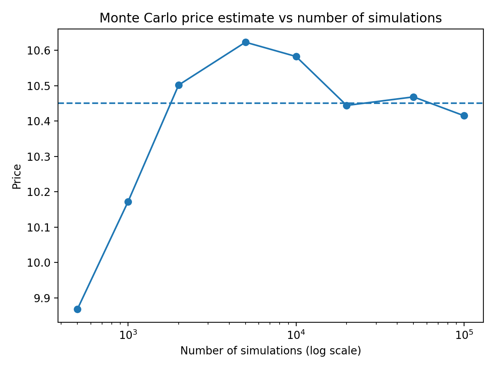
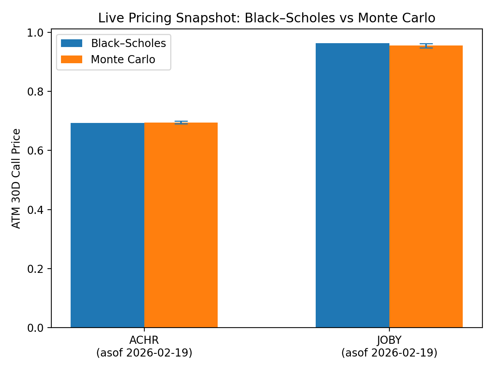
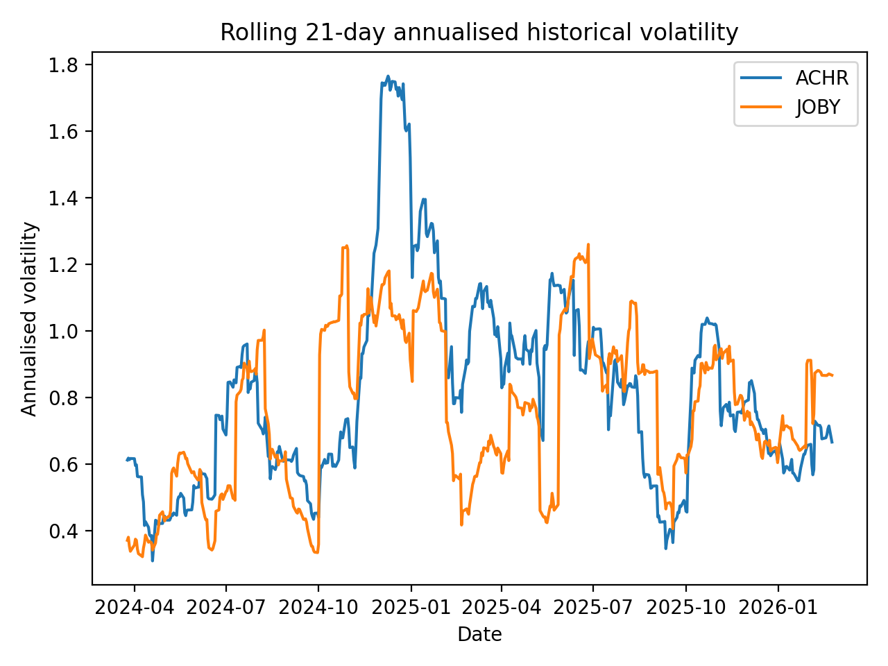

# Derivatives Pricing Engine  
### Analytical & Monte Carlo Option Pricing under the Black–Scholes Framework

---

## Overview

This project implements a modular derivatives pricing engine in Python for European equity options.  

The framework combines analytical Black–Scholes pricing with Monte Carlo simulation under risk-neutral Geometric Brownian Motion (GBM). It validates numerical convergence, applies variance reduction techniques, computes option Greeks, benchmarks computational efficiency, and integrates live market data.

The project demonstrates theoretical understanding, numerical analysis, and practical financial modelling.

---

## Mathematical Framework

Under the risk-neutral measure, the underlying stock follows Geometric Brownian Motion:

\[
dS_t = r S_t dt + \sigma S_t dW_t
\]

The no-arbitrage price of a European call option is:

\[
V_0 = e^{-rT} \mathbb{E}^{\mathbb{Q}}[(S_T - K)^+]
\]

This expectation is computed:

- Analytically using the Black–Scholes formula  
- Numerically using Monte Carlo simulation  

---

## Features

- Black–Scholes analytical pricing for European calls and puts  
- Monte Carlo pricing under GBM  
- Convergence analysis (error vs simulations)  
- Variance reduction via antithetic variates  
- Delta estimation using central finite differences  
- Runtime benchmarking (loop vs vectorised NumPy implementation)  
- Live market data integration via Yahoo Finance  
- Volatility sensitivity analysis across lookback windows  
- Maturity sensitivity analysis  
- Rolling historical volatility visualisation  

---

## Example Applications

The engine was applied to real equities such as:

- ACHR (Archer Aviation)
- JOBY (Joby Aviation)

Historical volatility estimates (~80%+) were observed, consistent with elevated uncertainty in early-stage growth companies.

30-day ATM option prices were found to represent ~9–10% of spot price, reflecting substantial short-term risk.

---

## Repository Structure

---

## Example Results

### Monte Carlo Convergence

### Multi-Ticker Comparison

### Volatility Analysis

---

## Key Insights

- Monte Carlo estimates converge to Black–Scholes at rate \(O(M^{-1/2})\)
- High-volatility equities (ACHR, JOBY) exhibit elevated short-term option premiums (~9–10% of spot)
- Option prices are highly sensitive to volatility estimation and maturity selection